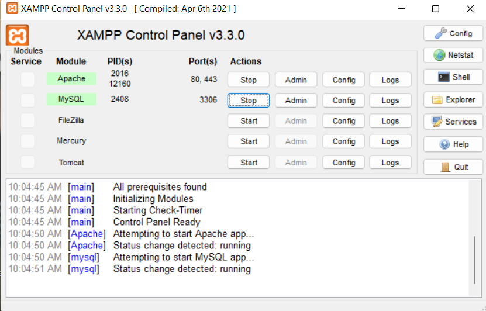
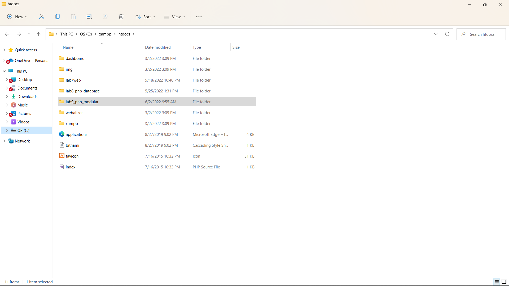
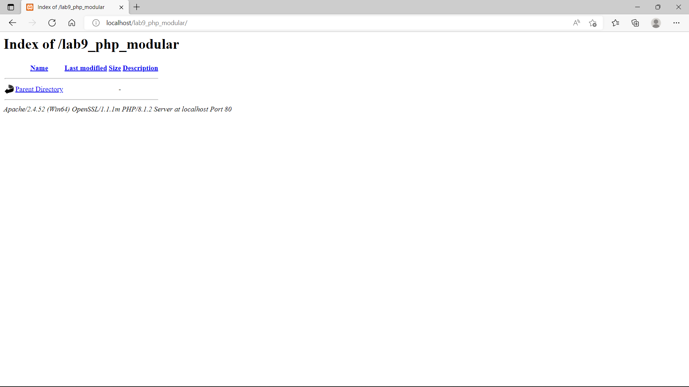
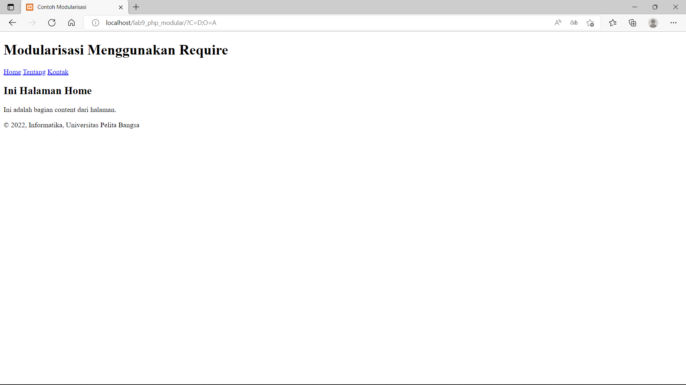

# lab9_php_modular

<hr>
Nama    : Maulana Muhamad <br>

NIM     : 312010188 <br>

Kelas   : TI.20. A.1 <br>
<hr>

### 1.MENJALANKAN XAMPP SERVER



### 2.MEMBUAT FOLDER BARU DENGAN NAMA LAB9_PHP_MODULAR



Kemudian jalanlan pada localhost server dengan mengakses URL:



### 3.MEMBUAT FILE BARU DENGAN NAMA header.php

```php
<!DOCTYPE html>
<html lang="en">
<head>
   <meta charset="UTF-8">
   <title>Contoh Modularisasi</title>
   <link href="style.css" rel="stylesheet" type="text/stylesheet" media="screen" />
</head>
<body>
   <div class="container">
       <header>
           <h1>Modularisasi Menggunakan Require</h1>
       </header>
       <nav>
           <a href="home.php">Home</a>
           <a href="about.php">Tentang</a>
           <a href="kontak.php">Kontak</a>
       </nav>
```

### 4.MEMBUAT FILE BARU DENGAN NAMA footer.php

```php
<footer>
            <p>&copy; 2022, Informatika, Universitas Pelita Bangsa</p>
        </footer>
    </div>
</body>
</html>
```

### 5.MEMBUAT FILE BARU NAMA home.php


```php
<?php require('header.php'); ?>

<div class="content">
    <h2>Ini Halaman Home</h2>
    <p>Ini adalah bagian content dari halaman.</p>
</div>

<?php require('footer.php'); ?>
```

### 6.MEMBUAT FILE BARU DENGAN NAMA FILE about.php

```php
<?php require('header.php'); ?>

<div class="content">
    <h2>Ini Halaman About</h2>
    <p>Ini adalah bagian content dari halaman.</p>
</div>

<?php require('footer.php'); ?>
```

### 7.TAMPILAN DI BROWSER NYA


